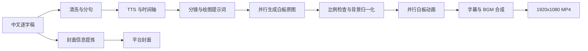

# Whiteboard Video Maker

把中文逐字稿自动制作成带配音、字幕、白板手绘动画、背景音乐和平台封面的 `1920x1080` 视频。

这个仓库同时面向两类使用者：

- 普通用户：按快速开始配置 API Key 后运行脚本。
- AI Agent：把仓库地址交给 Codex、Claude Code、OpenClaw 等工具，让 Agent 按 `AGENTS.md` 自动安装、检查并跑通演示。

## 功能

- 中文逐字稿清洗、分句和字幕切分
- MiniMax/302.AI 中文 TTS 与时间轴字幕
- APIMart、Kie、T8、macode 等 `gpt-image-2` 图像接口
- 白板绘制动画与手部覆盖层
- 并行生图、并行 TTS、并行白板渲染
- 低音量 BGM 混音和字幕烧录
- 中断续跑、分阶段缓存和强制重生成
- 固定视觉体系的 YouTube、小红书、抖音等平台封面
- Windows、macOS、Linux 安装脚本和环境诊断

## 固定生产规格

为避免每次生成时风格和排版漂移，下面的规格已经锁定：

| 项目 | 默认值 |
| --- | --- |
| 最终视频 | `1920x1080`, 30 fps, H.264/AAC |
| 生图请求 | `1792x1008`, 接近 16:9 |
| 图片比例 | 允许轻微偏差和拉伸；明显 3:2、方图、竖图会被拒绝 |
| 白板背景 | `#F6F1E3` |
| 绘画风格 | 黑色马克笔线条、克制的琥珀色、抽象无脸圆头人物 |
| 字幕 | 字号 `88`，单行最多 20 个全角字符，约占画面宽度 2/3 |
| 数字处理 | 配音使用中文读法，字幕优先显示阿拉伯数字 |
| BGM | 默认钢琴曲，`-28 dB`，约为人声听感的 10%-15% |
| YouTube 封面 | `1280x720`，统一的 editorial whiteboard 风格 |

## 工作流程



## 系统要求

- Python `3.11` 或 `3.12`
- `ffmpeg` 和 `ffprobe` 已加入 `PATH`
- 可访问所选 TTS、图片和封面接口的网络
- 建议至少 16GB 内存；白板渲染并发可按机器配置调整

ffmpeg 安装示例：

```powershell
# Windows，任选一种
winget install Gyan.FFmpeg
choco install ffmpeg
```

```bash
# macOS
brew install ffmpeg
# 如果 doctor 提示缺少 ass/libass 字幕滤镜：
brew install ffmpeg-full

# Ubuntu/Debian
sudo apt-get update && sudo apt-get install -y ffmpeg
```

## 快速开始

### Windows

```powershell
git clone --depth 1 https://github.com/shaomingchan/whiteboard.git
cd whiteboard
Set-ExecutionPolicy -Scope Process Bypass
powershell -ExecutionPolicy Bypass -File .\scripts\bootstrap.ps1
.\.venv\Scripts\python.exe scripts\configure_keys.py
powershell -ExecutionPolicy Bypass -File .\scripts\doctor.ps1
powershell -ExecutionPolicy Bypass -File .\scripts\run_demo.ps1
```

### macOS / Linux

```bash
git clone --depth 1 https://github.com/shaomingchan/whiteboard.git
cd whiteboard
bash scripts/bootstrap.sh
./.venv/bin/python scripts/configure_keys.py
bash scripts/doctor.sh
bash scripts/run_demo.sh
```

演示完成后应得到：

```text
output/demo/latest/final_video.mp4
output/demo/latest/composition_report.json
```

## API Key

最小的视频生成配置需要两个 Key：

| 用途 | 必需 | 配置位置 |
| --- | --- | --- |
| MiniMax/302.AI TTS | 是 | `auto-whiteboard/config/config.ini` |
| 一个图片供应商 | 是 | `skills/whiteboard-video-workflow/.env` |
| 302.AI 平台封面 | 仅生成封面时 | 同一个 `.env` 中的 `AI302_KEY` |
| Claude 智能分句 | 否 | 默认关闭，不需要配置 |

交互式配置：

```powershell
.\.venv\Scripts\python.exe scripts\configure_keys.py
```

Agent 或 CI 可使用非交互方式：

```powershell
.\.venv\Scripts\python.exe scripts\configure_keys.py `
  --non-interactive `
  --tts-key $env:TTS_KEY `
  --image-provider apimart_image2 `
  --image-key $env:IMAGE_KEY `
  --cover-key $env:AI302_KEY
```

支持的图片供应商：`apimart_image2`、`kie_image2`、`t8_image2`、`macode_image2`、`gemini_image`（Google 官方 Gemini API）。

只使用一个 Gemini Key 配置官方生图与中文配音（Gemini TTS 当前为 Preview）：

```bash
./.venv/bin/python scripts/configure_keys.py \
  --tts-provider gemini \
  --image-provider gemini_image
```

Gemini 默认使用 `gemini-3.1-flash-image` 生成 16:9、2K 图片，以及
`gemini-3.1-flash-tts-preview`、`Kore` 声线生成普通话配音。可通过
`GEMINI_IMAGE_MODEL`、`GEMINI_IMAGE_SIZE`、`GEMINI_TTS_MODEL` 和
`GEMINI_TTS_VOICE` 覆盖。

密钥只写入被 `.gitignore` 排除的本地文件。不要把 Key 放进逐字稿、README、命令历史或提交记录。

## 生成完整视频

准备 UTF-8 编码的 `.txt` 文件：

```powershell
.\.venv\Scripts\python.exe auto-whiteboard\scripts\auto_generate.py `
  --input "D:\scripts\my-video.txt" `
  --output-dir output\my-video `
  --project-dir output\my-video\v1 `
  --bgm skills\whiteboard-animation\assets\bgm\relaxing-piano-for-sleeping-312507.mp3 `
  --bgm-volume -28 `
  --tts-concurrency 16 `
  --whiteboard-jobs 4 `
  --keep-temp
```

macOS/Linux 使用相同参数，把路径分隔符换成 `/`。

常用参数：

| 参数 | 作用 |
| --- | --- |
| `--project-dir` | 指定稳定的项目目录，便于中断续跑 |
| `--keep-temp` | 保留中间结果，方便复用和排查 |
| `--force-tts` | 只重做配音 |
| `--force-split` | 只重做分句 |
| `--force-images` | 只重做原图 |
| `--force-whiteboard` | 只重做白板动画 |
| `--force-compose` | 只重做最终合成 |
| `--whiteboard-jobs` | 白板渲染并发，通常 `2-6` |

同一个 `--project-dir` 再次运行时，系统会根据指纹复用没有变化的 TTS、图片和动画片段。修改输入文案后，建议使用新的项目目录，或只强制重做受影响的阶段。

## 生成视频封面

首次使用封面功能时，确保配置了 `AI302_KEY`：

```powershell
.\.venv\Scripts\python.exe scripts\configure_keys.py --cover-key $env:AI302_KEY
powershell -ExecutionPolicy Bypass -File .\scripts\doctor.ps1 -RequireCover
```

生成 YouTube 封面：

```powershell
.\.venv\Scripts\python.exe scripts\generate_cover_302.py `
  --platform youtube `
  --title "建造文明的饮料" `
  --subtitle "一万年的啤酒史" `
  --topic "啤酒如何推动定居、城市和工业化" `
  --subject "a large beer glass and barley" `
  --left-context "Sumerian brewing and early settlement" `
  --right-context "modern city and global beer industry" `
  --timeline "一万年前|苏美尔|中世纪|工业革命|今天" `
  --output output\covers\beer_youtube.png
```

只检查提示词、不消耗额度：

```powershell
.\.venv\Scripts\python.exe scripts\generate_cover_302.py `
  --platform youtube --title "测试标题" --dry-run --print-prompt
```

平台预设：

| 平台 | 尺寸 |
| --- | --- |
| YouTube / Bilibili / 微信视频 | `1280x720` |
| 小红书 | `1440x1920` |
| 抖音 / 快手 | `1080x1920` |

封面 Skill 位于 `skills/youtube-cover-generator/`。Agent 应使用该 Skill 和统一脚本，不应为不同平台重新发明画风。

## 交给 Agent 安装

把下面这段话和仓库地址发给 Codex、Claude Code 或 OpenClaw：

```text
请克隆并跑通这个项目：https://github.com/shaomingchan/whiteboard.git
先阅读 AGENTS.md 和 AGENT_RUNBOOK.md。
请自行安装 Python 依赖并检查 ffmpeg，只向我索取必须的 API Key，不要在输出中展示完整 Key。
配置后运行 doctor 和 30 秒 demo，确认 final_video.mp4、composition_report.json 都正常。
最后告诉我视频路径、分辨率、音画时差，以及是否具备生成 YouTube 封面的条件。
```

Agent 的标准执行顺序：

1. 运行 `scripts/bootstrap.ps1` 或 `scripts/bootstrap.sh`。
2. 调用 `scripts/configure_keys.py` 写入本地密钥。
3. 运行 doctor；需要封面时增加 `--require-cover`。
4. 运行 30 秒 demo。
5. 读取 `composition_report.json` 并报告结果。

## 输出目录

典型项目目录：

```text
output/<project>/
├── final_video.mp4
├── composition_report.json
├── run_state.json
├── voiceover.wav
├── subtitles.srt
├── images/
├── whiteboard/
└── temp/
```

`composition_report.json` 的关键验收项：

- `output_width = 1920`
- `output_height = 1080`
- `single_line_subtitles = true`
- `output_av_delta_seconds < 0.1`

## 性能说明

实际耗时主要取决于外部 API 排队、生图数量和 CPU 白板渲染。GPU 目前不会显著加速 OpenCV/PyAV 主流程。长视频建议：

- 固定 `--project-dir`，利用缓存续跑。
- 图片接口稳定时再提高生图并发。
- `--whiteboard-jobs` 不要超过 CPU 和内存能稳定承受的范围。
- 只修改字幕或 BGM 时使用 `--force-compose`，不要重做全部图片。
- 首次开源克隆建议使用 `git clone --depth 1`，避免下载历史版本里的大媒体文件。

## 常见问题

### doctor 显示找不到 ffmpeg

安装 ffmpeg，重新打开终端，确认 `ffmpeg -version` 和 `ffprobe -version` 都能执行。

### 图片接口失败

检查 `.env` 中的供应商、Key、余额、并发和 Base URL。频繁出现限流时降低 `*_IMAGE_CONCURRENCY`。

使用 Gemini 时如果返回 `User location is not supported for the API use`，说明当前网络出口地区不在
Gemini Developer API 支持范围。这不是 Key 或请求参数错误；请在遵守 Google 服务条款及当地法规的
前提下，改用受支持地区的运行环境后再执行真实 TTS、生图和完整 demo。

### 图片比例错误或画面拉伸

系统允许接近 16:9 的轻微偏差，但会拒绝明显的 3:2、方图或竖图。失败的场景使用 `--force-images` 重试。

### 封面提示找不到 302ai

重新运行 bootstrap。CLI 安装在项目 `.venv` 中，封面脚本会优先使用本地可执行文件。

### 只想重新合成字幕或 BGM

保持原来的 `--project-dir`，增加 `--force-compose`。

### Windows PowerShell 禁止执行脚本

只为当前终端临时放行：

```powershell
Set-ExecutionPolicy -Scope Process Bypass
```

## 项目结构

```text
whiteboard/
├── auto-whiteboard/              # 主视频流水线
│   ├── config/                   # 可提交的配置模板
│   ├── scripts/                  # TTS、字幕、动画和合成
│   └── tests/                    # 单元测试
├── examples/                     # 短演示逐字稿
├── scripts/                      # 安装、配置、doctor、demo、封面
├── skills/
│   ├── auto-whiteboard-video/    # 文本生成完整视频
│   ├── whiteboard-animation/     # 白板动画渲染器
│   ├── whiteboard-video-workflow/# 生图和分镜工作流
│   └── youtube-cover-generator/  # 统一平台封面 Skill
├── AGENTS.md
├── AGENT_RUNBOOK.md
├── ASSETS.md
└── LICENSE
```

## 安全与隐私

- 本地密钥文件、输出视频和临时文件均被 `.gitignore` 排除。
- 推送前运行 `.\.venv\Scripts\python.exe scripts\check_no_secrets.py`。
- 逐字稿、提示词和生成媒体会发送给所选第三方 API，请先确认内容适合上传。
- 不要在 issue、日志、截图或聊天记录中公开 API Key。

## 资源许可

代码使用 MIT License。BGM、手部图片和其他媒体资源不自动适用 MIT License，详情见 `ASSETS.md`。公开分发或商业使用前，请确认你对这些资源拥有相应权利，也可以直接替换为自己的资源。

## 开发与贡献

提交前运行：

```powershell
.\.venv\Scripts\python.exe -m unittest discover -s auto-whiteboard\tests -p "test_*.py"
.\.venv\Scripts\python.exe scripts\doctor.py
.\.venv\Scripts\python.exe scripts\check_no_secrets.py
git diff --check
```

欢迎提交 issue 和 pull request。请保持生产规格、字幕规则和封面风格向后兼容；会改变成片视觉效果的修改应附带样张或截图。
